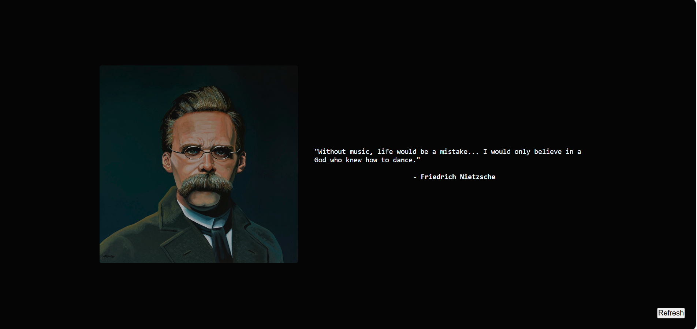
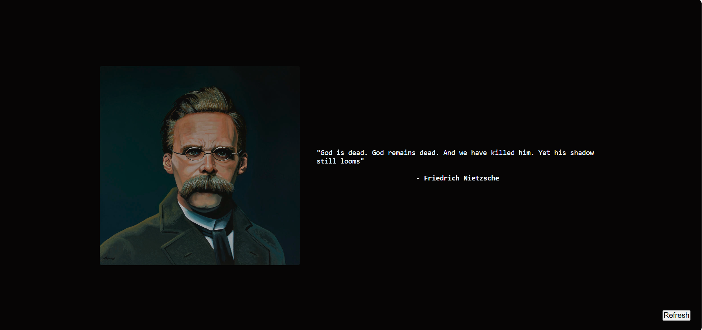
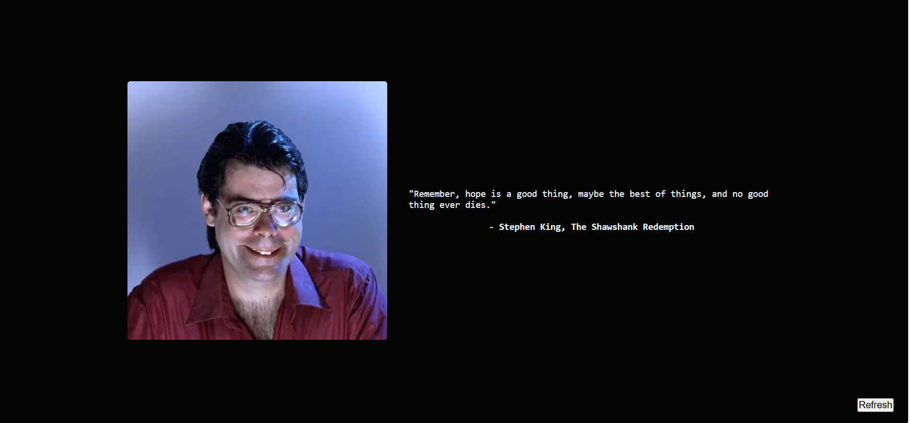

# 🎯 Quotes Project

A beautiful and inspiring web app that displays quotes from some of the most iconic personalities — including Rumi, Friedrich Nietzsche, John Steinbeck, Freddie Mercury, Stephen King, and more.

The goal of this project is to **uplift, provoke thought, and bring emotion** through powerful words and elegant design.

---

## ✨ Features

- 🧠 Curated quotes from philosophers, writers, and artists
- 🎨 Clean and aesthetic UI
- 🔄 Refresh to get a new quote
- 📷 Screenshots below

---

## 📸 Screenshots

### 🏠 Home View


### 📝 Quote Generator


### 💬 Famous Quote Display


### 🧾 Author Details or Additional View


---

## 🚀 Getting Started

Clone the repository and run:

```bash
npm install
npm start
